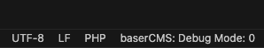

# baserCMS Debug Toggle

 

baserCMS 4.x および 5.x のデバッグモードを切り替えるためのVSCode拡張機能です。

## 機能

- baserCMS 4.x のデバッグモードを `0`, `1`, `2` の間で切り替え可能
- baserCMS 5.x のデバッグモードを `true` と `false` の間で切り替え可能
- baserCMSのバージョンは自動で検出
- 現在のデバッグモードをVSCodeのステータスバーに表示

## インストール方法

- Visual Studio Code の拡張機能で `baserCMS Debug Toggle` を検索し、インストール
- [Visual Studio Code Marketplace](https://marketplace.visualstudio.com/vscode) からインストール

## 使い方

1. VSCodeでbaserCMSプロジェクトを開きます。
2. コマンドパレット (`Ctrl+Shift+P`) から「Toggle baserCMS Debug Mode」を実行してください。
3. ステータスバーに現在のデバッグモードが表示されます。
4. ステータスバーのアイテムをクリックするか、コマンドパレットから切り替えを実行できます。

## スクリーンショット

## その他

- リリースノート: [CHANGELOG](CHANGELOG.md)
- 貢献ガイド: [CONTRIBUTING](.github/CONTRIBUTING.md)
- サポート: [GitHub issues](https://github.com/fuchigam1/basercms-debug-toggle/issues)
- ライセンス: [LICENSE](LICENSE)
